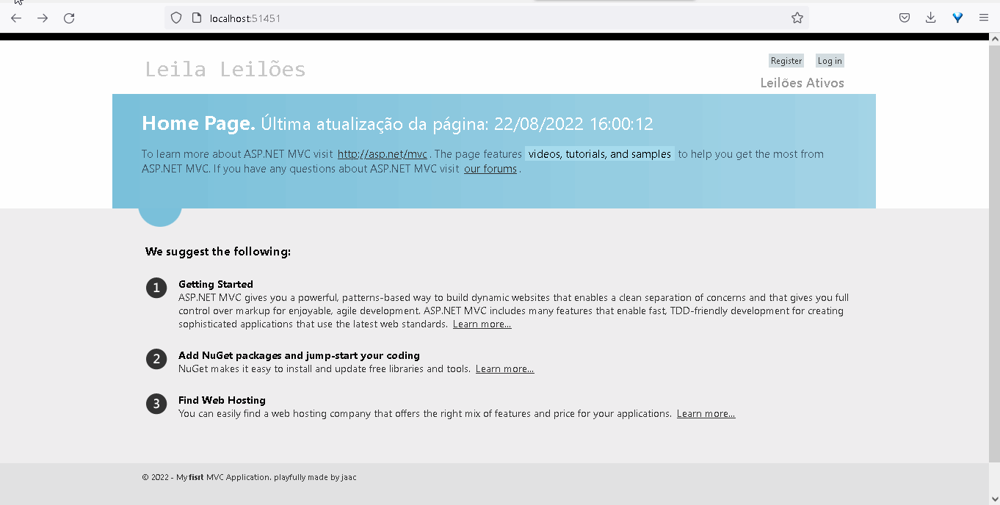
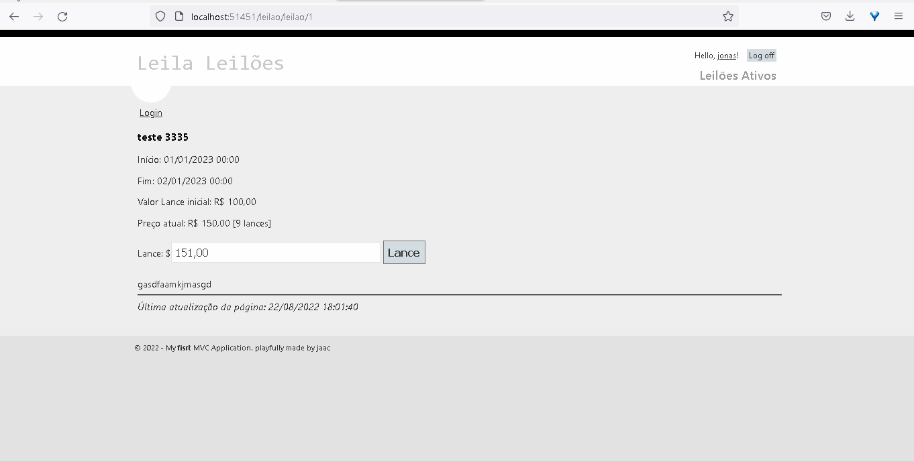
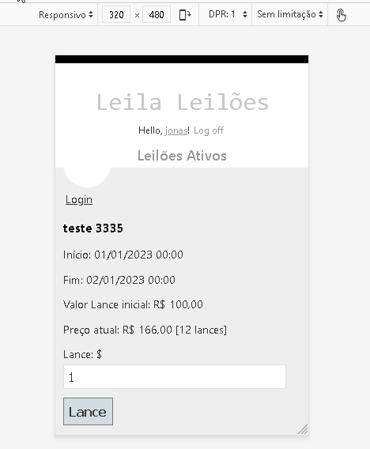
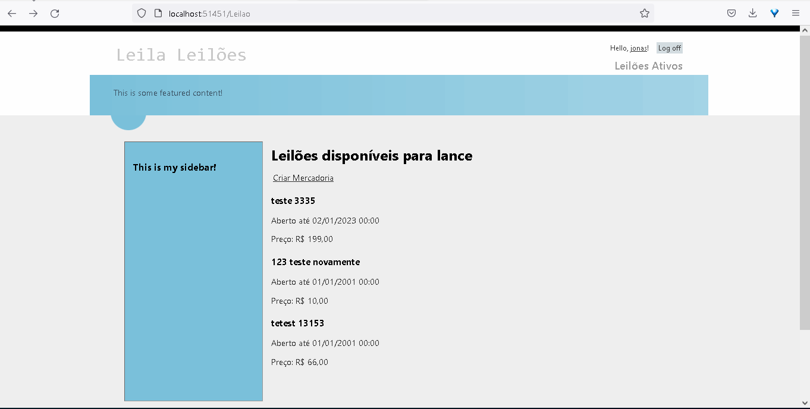

<h2> Leila Leilões entre amigos </h2>

 Projeto de estudo, criando um sistema de leilões utilizando .net framework 4.5 4

- [Todo list](#todo-list)
- [Testes](#testes)
- [Demo](#demo)
  - [Tela Inicial](#tela-inicial)
  - [Cadastro de Novo produto Leilão](#cadastro-de-novo-produto-leilão)
  - [Tela para lances](#tela-para-lances)
  - [Funcionamento em dispositivos móveis](#funcionamento-em-dispositivos-móveis)
  - [Área Administrativa](#área-administrativa)
  - [Área Administrativa](#área-administrativa-1)

 ## Todo list
 
 - [ ] Limpar código
 - [ ] Criar apresentação do projeto com exemplos e casos de uso
 - [ ] Fazer deploy
 - [ ] Refatorar telas mobile
 - [ ] Rever layout geral
 - [ ] Inserir Links de navegação dinâmica na lista de leilões, de modo que usuário possa abrir a lista, clicar no link e ser direcionado para o leilão
 - [ ] Fazer validação de expiração de data do leilão para os links da lista de leilões (link dinâmico somente se leilão ativo? caso inativo não apresenta link)
 - [ ] Conferir `span` da página de lances na contagem de lances totais após o usuário dar o lance
 
 ## Testes

 - [x] Rota listar leilões ativos
 - [x] Área de admin usuários
 - [x] Restrição de acesso para somente usuário logado ()
 - [x] Página de leilao
 - [x] Busca de leilões (retorna um json)
 - [💀] criação de novo produto para leilão
   - alguma coisa se perdeu após commit de persistência de dados
 - 

 ## Demo

### Tela Inicial

Tela incial > Página de leilões ativos > controle de acesso permitindo editar somente usuários logados

### Cadastro de Novo produto Leilão

😭 estava funcionando... verificar commits anteriores (alteração de nomes de classes, variáveis, rotas?)

### Tela para lances

http://localhost:51451/leilao/leilao/1

### Funcionamento em dispositivos móveis

### Área Administrativa

Tela de adicionar/remover/editar usuários

### Área Administrativa

Busca de Leilões ativos (retorno de json)

